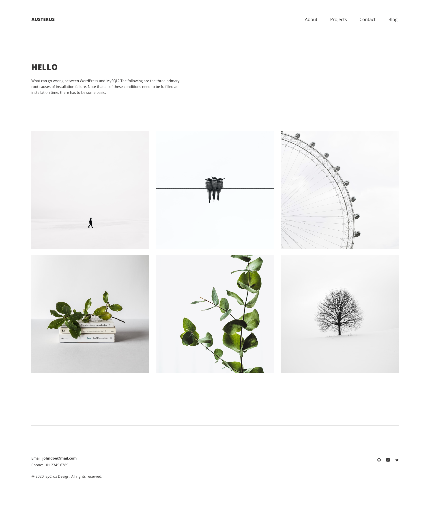

# Austerus

Austerus is a minimal portfolio WordPress Theme. 

## Project Goals

The overall goal of this project is to get more acquainted with [WordPress](https://wordpress.org/). It started with 
taking a deeper dive by going through this [Udemy course](https://www.udemy.com/course/become-a-wordpress-developer-php-javascript/learn/lecture/7399554#questions)
to learn how to create custom WordPress theme. The actual Austerus theme is currently in 'alpha'. At the moment I have
a [separate branch](https://github.com/yarocruz/austerus/tree/real-austerus) where I'm just reverse engineering
the Udemy course project. 

## Demo

Project is super barebones at the moment by you can checkout the demo here. [Austerus](http://jayc1.sgedu.site/).

 
